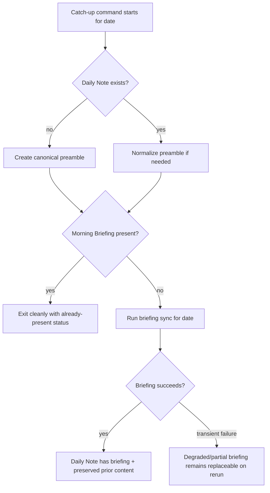

# fix: Restore daily-note rollover catch-up

## Summary

Today’s Daily Note was recovered manually by running the briefing sync for `2026-07-04`; the successful run restored the Morning Briefing, Calendar, To-Think, To-Do, and rollover content. This plan prevents the same failure mode by adding a repo-owned catch-up path for missed scheduled runs and by making every workflow that creates a Daily Note use the same preamble/idempotency rules.

---

## Problem Frame

The scheduled briefing did not write a `2026-07-04` Morning Briefing before other automation appended to the note. The launch log showed successful `2026-07-03` runs but no `2026-07-04` briefing entry, while the note existed with only a Vault Housekeep addendum and an ingestion link. Running `ingest/briefing_sync.py --date 2026-07-04` manually proved Google credentials and calendar/email access were working; the first recovery attempt failed only at MiniMax generation timeout, and the second succeeded.

A second issue appeared during recovery: `ingest/weekly_housekeep_propose.py` creates a frontmatter-only daily-note stub, while `ingest/briefing_sync.py` later repairs missing daily-note preambles by prepending a full preamble. That produced duplicate frontmatter before it was cleaned from today’s note.

---

## Requirements

**Recovery and scheduling reliability**

- R1. A missed scheduled briefing run must be detectable from the Daily Note content, not only from launch logs.
- R2. A repo-owned catch-up command must be able to generate today’s briefing when the note exists but lacks `## Morning Briefing ☀️`.
- R3. Catch-up must preserve existing non-briefing note content such as Vault Housekeep addenda and ingestion links.
- R4. Transient MiniMax failures must not be mistaken for a permanent scheduling failure; rerun behavior must replace degraded/partial briefing content when a later run succeeds.

**Daily Note shape and rollover**

- R5. Any repo workflow that creates `Daily Notes/YYYY-MM-DD.md` must create the same preamble shape, including the `Days:[[...]]` navigation line.
- R6. Adding the canonical preamble to an existing note must not duplicate YAML frontmatter.
- R7. Rollover extraction must continue to read unchecked To-Think, To-Do, and Hermes-to-do items from yesterday’s note.

**Operator visibility**

- R8. Scheduling documentation must explain the catch-up path and distinguish missed launch execution from credential or API failures.

---

## Key Technical Decisions

- **Use Daily Note content as the health signal:** The durable question is whether `Daily Notes/YYYY-MM-DD.md` contains the briefing marker, not whether a specific log line exists. Logs can be absent after sleep, timezone changes, or launchd quirks; the note content is the user-visible contract.
- **Centralize Daily Note preamble behavior:** `ingest/briefing_sync.py` already owns `build_note_preamble()` and preamble detection. A shared helper prevents housekeep and future workflows from creating subtly different stubs.
- **Add catch-up as a small repo CLI, not a launchd-only fix:** The codebase can test and document a catch-up command. Installing or editing the user LaunchAgent remains an operational step after implementation, because it changes local macOS state outside the repo.
- **Keep reruns idempotent:** Existing `write_briefing()` behavior replaces prior briefing/degraded content while preserving content above the briefing marker. The fix should strengthen that behavior rather than introduce a separate rewrite path.

---

## High-Level Technical Design

---

## Implementation Units

### U1. Extract shared Daily Note preamble helpers

- **Goal:** Move canonical Daily Note creation and preamble normalization into a shared helper that both briefing and housekeep can use.
- **Requirements:** R5, R6, R7.
- **Dependencies:** None.
- **Files:**
  - `ingest/briefing_sync.py`
  - `ingest/daily_note_helpers.py`
  - `tests/test_briefing_sync.py`
  - `tests/test_daily_note_helpers.py`
- **Approach:** Create a small helper module for `build_note_preamble`, preamble detection, and “ensure note exists with canonical preamble” behavior. Keep the existing public behavior in `briefing_sync.py` by importing the helper rather than changing rollover extraction semantics.
- **Patterns to follow:** Existing retry-aware file access in `ingest/briefing_sync.py`; existing `build_note_preamble()` output format.
- **Test scenarios:**
  - Given no Daily Note exists, ensuring the note creates frontmatter plus the `Days:[[Daily Notes/<prev> | Yesterday]] <== [[Daily Notes/<date>]] ==> [[Daily Notes/<next>|Tomorrow]]` navigation line.
  - Given a note with only YAML frontmatter and body content, ensuring the preamble inserts the missing `Days:` line without duplicating frontmatter.
  - Given a note that already has the canonical preamble, ensuring the helper leaves content byte-for-byte unchanged.
  - Given an iCloud `EDEADLK` read/write error before success, ensuring the helper retries using the same bounded retry posture as briefing sync.
- **Verification:** All existing briefing-sync rollover tests still pass, and new helper tests prove preamble normalization is idempotent.

### U2. Make weekly housekeep use the canonical Daily Note helper

- **Goal:** Prevent housekeep from creating frontmatter-only Daily Notes that later require briefing repair.
- **Requirements:** R3, R5, R6.
- **Dependencies:** U1.
- **Files:**
  - `ingest/weekly_housekeep_propose.py`
  - `tests/test_weekly_housekeep_propose.py`
- **Approach:** Replace the local frontmatter-only creation in `write_addendum_to_daily_note()` with the shared ensure/normalize helper. Preserve the addendum replacement behavior keyed by `## Vault Housekeep 🧹` and the `housekeep-id`/`housekeep-until` comments.
- **Patterns to follow:** Current `write_addendum_to_daily_note()` idempotent replacement behavior and existing housekeep tests around rollover markers.
- **Test scenarios:**
  - Given no Daily Note exists, writing a housekeep addendum creates a note with the canonical preamble and the addendum below it.
  - Given a frontmatter-only note exists, writing a housekeep addendum upgrades the note to canonical preamble form without duplicate YAML.
  - Given an existing housekeep block, writing again replaces only that block and preserves briefing content elsewhere in the note.
- **Verification:** Housekeep tests assert canonical preamble shape and unchanged addendum idempotency.

### U3. Add a briefing catch-up command

- **Goal:** Provide a repo-owned command that detects a missing Morning Briefing and runs the existing briefing sync for that date.
- **Requirements:** R1, R2, R3, R4.
- **Dependencies:** U1.
- **Files:**
  - `cli/daily_briefing_catchup.py`
  - `ingest/briefing_sync.py`
  - `tests/test_daily_briefing_catchup.py`
- **Approach:** Add a small CLI that accepts `--date` and `--force`. Without `--force`, it should ensure the note exists in canonical shape, check for `## Morning Briefing ☀️`, and exit cleanly if present. If missing, it should invoke the existing briefing sync path for that date and report whether the run wrote a full briefing, degraded briefing, or failed. Keep the actual briefing generation in `briefing_sync.py` so there is one writer for briefing content.
- **Patterns to follow:** `cli/daily_note_youtube.py` argument parsing style; `briefing_sync.main()` date handling; existing degraded-sync marker behavior.
- **Test scenarios:**
  - Given today’s note is missing, catch-up creates the note and calls the briefing runner for the date.
  - Given today’s note exists with housekeep content but no Morning Briefing, catch-up calls the briefing runner and preserves the pre-briefing content.
  - Given today’s note already contains `## Morning Briefing ☀️`, catch-up exits without invoking the briefing runner.
  - Given `--force`, catch-up invokes the briefing runner even when the marker already exists.
  - Given the runner returns a nonzero result after writing degraded content, catch-up exits nonzero and prints a status that distinguishes transient downstream failure from “already present.”
- **Verification:** Tests monkeypatch the runner so they verify control flow without calling Google, MiniMax, or the live vault.

### U4. Document the scheduling/catch-up operating model

- **Goal:** Make the next failure diagnosable without rediscovering the launchd/log/note-content distinction.
- **Requirements:** R8.
- **Dependencies:** U3.
- **Files:**
  - `README.md`
- **Approach:** Update the scheduling section to add the catch-up command, explain that missed launch execution appears as a note without `## Morning Briefing ☀️`, and recommend running catch-up manually before debugging credentials. Note that LaunchAgent installation or StartInterval changes are local machine operations outside the repo plan.
- **Patterns to follow:** Current README scheduling and manual verification sections.
- **Test scenarios:** Test expectation: none — documentation-only unit.
- **Verification:** README contains a clear recovery path for “today’s note exists but no rollover/Morning Briefing.”

---

## Scope Boundaries

### In scope

- Repo code that creates, normalizes, or writes Daily Notes.
- A tested catch-up command for missed daily briefings.
- README documentation for diagnosing missed briefing vs. credential/API failures.

### Deferred to Follow-Up Work

- Installing or modifying the user’s LaunchAgent to run the catch-up command on a StartInterval cadence.
- Backfilling older dates beyond today’s recovery.
- Changing the 7am priority check-in workflow, which is separate from Morning Briefing generation.

### Out of scope

- Reworking Google OAuth or MiniMax authentication, because today’s manual recovery proved credentials were usable.
- Changing Transcript.lol, YouTube ingestion, or Vault Housekeep proposal scoring.

---

## Risks & Dependencies

- **iCloud file locking:** Daily Notes live under iCloud Drive, so helper functions must keep bounded retry behavior for read/write operations.
- **Import boundaries:** A new helper module must not create circular imports between `ingest/briefing_sync.py` and housekeep.
- **Local scheduling state:** The repo can ship a catch-up command and documentation, but the macOS LaunchAgent still needs a separate local update to become automatic.
- **LLM generation flakiness:** MiniMax can time out after calendar/email fetch succeeds; reruns must keep degraded content replaceable.

---

## Sources / Research

- `ingest/briefing_sync.py`: existing briefing writer, rollover extraction, degraded-sync behavior, and retry-aware file access.
- `ingest/weekly_housekeep_propose.py`: current frontmatter-only Daily Note creation and housekeep addendum replacement.
- `tests/test_briefing_sync.py`: existing coverage for iCloud deadlock retries and degraded rollover preservation.
- `tests/test_weekly_housekeep_propose.py`: existing housekeep addendum and proposal behavior coverage.
- `README.md`: current scheduling, logs, and manual verification documentation.
- Live recovery observation: `2026-07-04` note had housekeep/ingestion content but no Morning Briefing before manual catch-up; second manual briefing run succeeded and restored rollover.
