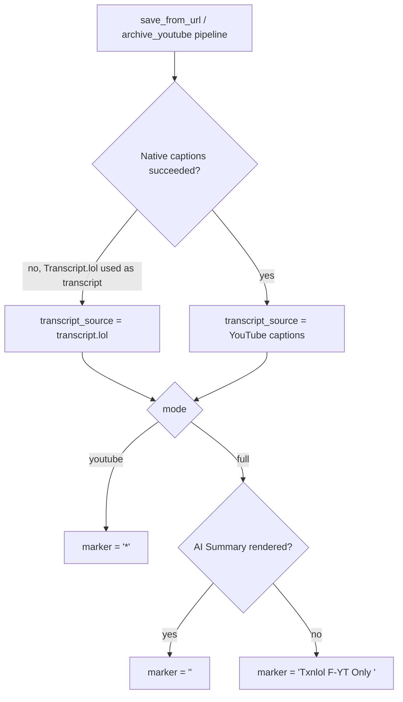

# fix: YouTube ingest filename marker reflects AI Summary presence, not transcript source

## Summary

`youtube_ingest_stem()` decides the `*` filename marker from `transcript_source` alone (`"transcript.lol"` → no marker, anything else → `*`). Since the caption-first refactor made native YouTube captions the default source for nearly every note, almost every new note now gets `*` regardless of whether Transcript.lol also produced a usable AI Summary. This plan makes the marker decision track AI Summary presence instead, and adds a distinct `Txnlol F-YT Only` marker for the specific case the user cares about: native captions succeeded but Transcript.lol's summary step failed or was skipped, so the note is YouTube-transcript-only.

---

## Problem Frame

`cli/export_transcripts.py:youtube_ingest_stem()` computes:

```
fallback_marker = "" if transcript_source == "transcript.lol" else "*"
```

Both `cli/transcript_server.py:TranscriptService.save_from_url()` (mode `"full"`) and `cli/archive_youtube.py` always attempt native YouTube captions first, then optionally backfill an AI Summary via Transcript.lol. `transcript_source` ends up `"YouTube captions"` in the common case even when the AI Summary backfill succeeded — so the note gets `*` even though it has a complete `## AI Summary` section, which is the opposite of what the marker is supposed to signal (see origin: user request, no upstream requirements doc found in `docs/brainstorms/`).

Two behaviors are requested:

1. When native captions succeed but the Transcript.lol summary attempt fails/is unavailable, mark the note `Txnlol F-YT Only` instead of `*`, and keep writing just the native-caption transcript (this content behavior already happens today — only the marker text is new).
2. The marker should be governed by whether the note ends up with an `## AI Summary` section, not by which `transcript_source` string produced the transcript.

Three call sites independently precompute both of `youtube_ingest_stem()`'s two possible outputs to check for an existing note before reprocessing a URL (`cli/daily_note_youtube.py`, `cli/export_transcripts.py`'s batch export loop, `cli/archive_youtube.py`). Any change to the marker scheme must keep these dedup prechecks in sync or reruns will silently reprocess/duplicate notes.

`cli/archive_youtube.py` has the identical bug via its own `build_archive_markdown()` (renders `## AI Summary` under the same `if ai_summary_text:` gate, but names the file via the same `transcript_source`-only `youtube_ingest_stem()` call) — it is in scope for the same fix.

`mode="youtube"` (the "▶ YouTube Only" button in the Chrome extension) never attempts Transcript.lol at all, so it never has an AI Summary. It keeps the plain `*` marker unchanged — `Txnlol F-YT Only` is specifically for the case where Transcript.lol *was* attempted and failed, not where it was never invoked.

---

## Requirements

- R1. A YouTube note (`mode="full"`) that ends up with a rendered `## AI Summary` section must have no fallback marker in its filename.
- R2. A YouTube note (`mode="full"`) with native captions but no rendered `## AI Summary` section must be marked `Txnlol F-YT Only` instead of `*`.
- R3. A YouTube note written via `mode="youtube"` (captions-only, Transcript.lol never attempted) keeps the existing `*` marker.
- R4. Non-YouTube notes (Vimeo, generic) keep today's marker behavior in practice: no observed change, since they never populate an AI Summary today, but the decision must route through the same has-AI-Summary rule as YouTube for consistency and to avoid future drift.
- R5. `cli/archive_youtube.py` must apply the same three-way marker rule (R1–R3) as `cli/transcript_server.py`, since it has the same bug.
- R6. Every existing dedup precheck that enumerates candidate destination stems before calling `save_from_url` (or before archive_youtube's own write) must be extended to recognize all marker variants a video could have been written under, so reruns do not reprocess or duplicate an already-ingested video.
- R7. The marker decision logic must reuse or exactly mirror the same "does this note have an AI Summary" condition `build_markdown()` / `build_archive_markdown()` already use to render the `## AI Summary` heading (`ai_summary_text and ai_summary_norm != description_norm`), so the filename marker and the rendered content can never disagree.

---

## Key Technical Decisions

- **Marker text replaces `*`, not stacks with it.** For the "native captions, no AI Summary" case, the filename gets `Txnlol F-YT Only ` in place of `*` — one marker per note, not `*Txnlol F-YT Only `. A single unambiguous marker is easier to read in the vault and to detect in dedup prechecks.
- **Decision keyed on AI-Summary presence, computed with the same normalization `build_markdown()` already uses.** Do not introduce a second, slightly different "is there a summary" check — reuse the existing dedup-normalization comparison (`ai_summary_norm != description_norm`) so the marker can never drift from what's actually rendered under `## AI Summary`.
- **`mode="youtube"` is a distinct case from "Transcript.lol failed."** It never invokes Transcript.lol, so labeling it `Txnlol F-YT Only` would be misleading (nothing "failed" — it was never attempted). It keeps plain `*`.
- **Introduce one shared marker-resolution function** in `cli/export_transcripts.py` (already the shared home of `youtube_ingest_stem()`) taking `(mode, has_ai_summary)` and returning one of `""`, `"Txnlol F-YT Only "`, `"*"`. `cli/transcript_server.py` and `cli/archive_youtube.py` both call it. This is the single place the three-way rule lives, preventing the two pipelines from re-diverging the way `transcript_source`-only logic already diverged from the content-rendering logic.
- **`youtube_ingest_stem()`'s signature changes from `transcript_source` to an explicit `marker` string.** Callers compute the marker via the new resolver (or, for dedup prechecks that need to enumerate all possible outcomes before knowing the real one, pass each candidate marker directly). This removes the implicit `transcript_source == "transcript.lol"` special-casing that caused the bug and makes every call site's marker choice explicit and auditable.
- **Dedup prechecks enumerate three candidate stems, not two**, once a video could plausibly land under `""`, `"Txnlol F-YT Only "`, or `"*"`.

---

## High-Level Technical Design



---

## Implementation Units

### U1. Add shared marker-resolution helper in `cli/export_transcripts.py`

- **Goal:** Centralize the three-way marker decision and change `youtube_ingest_stem()` to accept an explicit marker instead of deriving one from `transcript_source`.
- **Requirements:** R1, R2, R3, R4, R7.
- **Dependencies:** None.
- **Files:**
  - `cli/export_transcripts.py`
  - `tests/test_youtube_ingest_naming.py`
- **Approach:** Add a `MARKER_TXNLOL_ONLY = "Txnlol F-YT Only "` constant alongside the existing fallback marker. Add `resolve_youtube_marker(*, mode: str, has_ai_summary: bool) -> str` implementing: `mode != "full"` → `"*"`; `mode == "full" and has_ai_summary` → `""`; `mode == "full" and not has_ai_summary` → `MARKER_TXNLOL_ONLY`. Change `youtube_ingest_stem(title, *, marker: str, ingested_on=None)` to take the marker directly rather than `transcript_source`, so it becomes a pure "date + marker + sanitized title" formatter with no knowledge of transcript sourcing. Update the non-YouTube stem path (currently `stem_prefix = "" if transcript_source == "transcript.lol" else "*"` in `cli/transcript_server.py`) to also call `resolve_youtube_marker` for consistency, per R4 — for non-YouTube sources `has_ai_summary` is always `False` today, so behavior is unchanged in practice.
- **Patterns to follow:** Existing `sanitize_title()` / `youtube_ingest_stem()` module-level function style in `cli/export_transcripts.py`.
- **Test scenarios:**
  - `resolve_youtube_marker(mode="youtube", has_ai_summary=False)` → `"*"`.
  - `resolve_youtube_marker(mode="youtube", has_ai_summary=True)` → `"*"` (mode gates before summary check; `mode="youtube"` never actually produces `has_ai_summary=True` in practice, but the function must not special-case that away from `"*"`).
  - `resolve_youtube_marker(mode="full", has_ai_summary=True)` → `""`.
  - `resolve_youtube_marker(mode="full", has_ai_summary=False)` → `"Txnlol F-YT Only "`.
  - `youtube_ingest_stem("A Video Title", marker="", ingested_on=date(2026,7,15))` → `"20260715 A Video Title"`.
  - `youtube_ingest_stem("A Video Title", marker="Txnlol F-YT Only ", ingested_on=date(2026,7,15))` → `"20260715 Txnlol F-YT Only A Video Title"`.
- **Verification:** Updated `YouTubeIngestStemTests` pass; no remaining references to `transcript_source=` as a `youtube_ingest_stem()` keyword argument anywhere in the repo (`grep -rn "youtube_ingest_stem(" cli/ tests/`).

### U2. Update `TranscriptService.save_from_url()` to use the resolver

- **Goal:** Fix the over-marking bug in the primary ingestion path (`daily_note_youtube.py`, `transcript.py`, the Chrome extension's two buttons).
- **Requirements:** R1, R2, R3, R7.
- **Dependencies:** U1.
- **Files:**
  - `cli/transcript_server.py`
  - `tests/test_youtube_ingest_naming.py`
- **Approach:** Compute `has_ai_summary` using the exact same normalization `build_markdown()` uses (`ai_summary_text and ai_summary_norm != description_norm`) before the stem/destination is computed — this means either moving that normalization earlier in `save_from_url()` or computing it once and threading it into both the stem decision and `build_markdown()`'s call so they can't disagree. Replace the current `transcript_source == "transcript.lol"`-keyed stem logic (both the YouTube branch and the non-YouTube branch) with `resolve_youtube_marker(mode=normalized_mode, has_ai_summary=has_ai_summary)` feeding into `youtube_ingest_stem(title, marker=marker, ...)`. The overwrite-guard for `transcript_source == "unavailable"` is unaffected — it does not need to change.
- **Patterns to follow:** Existing control flow in `save_from_url()` — native-captions-first, then conditional Transcript.lol summary/backfill in `mode="full"`.
- **Test scenarios:**
  - `mode="youtube"`, native captions succeed → stem keeps `*` (regression guard for existing behavior, R3).
  - `mode="full"`, native captions succeed, Transcript.lol summary succeeds → stem has no marker (fixes R1/the reported bug).
  - `mode="full"`, native captions succeed, Transcript.lol summary fails/unavailable → stem is `Txnlol F-YT Only ` and the note body contains no Transcript.lol placeholder text, only the native transcript (R2; confirms existing content behavior is preserved, only the marker changes).
  - `mode="full"`, native captions fail, Transcript.lol supplies the transcript itself and a summary → stem has no marker.
  - `mode="full"`, native captions fail, Transcript.lol supplies the transcript but no summary → stem is `Txnlol F-YT Only ` (this is a real behavior change from today, where `transcript_source == "transcript.lol"` always suppressed the marker regardless of summary — call this out explicitly in the PR description since it's a deliberate consequence of R1/R7, not an oversight).
  - Non-YouTube (Vimeo), `mode="full"`, no AI Summary attempted → stem keeps `*` (regression guard for R4).
- **Verification:** `TranscriptServiceNamingTests` updated and passing; manually confirm via `python3 -u cli/transcribe.py "https://vimeo.com/76979871"`-style spot check is not required since this unit is filename-only and fully covered by unit tests against a temp directory.

### U3. Update `cli/archive_youtube.py` to use the resolver

- **Goal:** Fix the same over-marking bug in the independent archive pipeline (`build_archive_markdown()`), which has never called `save_from_url()` and would otherwise keep the bug after U2 ships.
- **Requirements:** R5, R7.
- **Dependencies:** U1.
- **Files:**
  - `cli/archive_youtube.py`
  - `tests/test_youtube_ingest_naming.py`
- **Approach:** At the point `prefixed_stem = youtube_ingest_stem(safe_title, transcript_source=transcript_source)` is currently computed, first determine `has_ai_summary` using the same normalized-comparison rule as `build_archive_markdown()`'s own `if ai_summary_text:` gate (compare against `description`, mirroring U2), then call `resolve_youtube_marker(mode="full", has_ai_summary=...)` (archive_youtube.py has no `mode="youtube"` equivalent — it always behaves like `mode="full"`) followed by `youtube_ingest_stem(safe_title, marker=marker)`.
- **Patterns to follow:** U2's resolver usage; existing `prepare_youtube_summary_context()` call already present in this file.
- **Test scenarios:**
  - Native captions succeed, `prepare_youtube_summary_context` returns a non-empty summary → written stem has no marker.
  - Native captions succeed, `prepare_youtube_summary_context` returns empty summary → written stem is `Txnlol F-YT Only `.
  - Existing `test_existing_date_prefixed_youtube_note_is_not_rewritten` continues to pass unchanged (it uses `summary=""`, exercising the "no marker" vs `*` distinction under the old scheme — needs updating to expect no rewrite regardless of which marker variant is checked, since the existing note in that test uses no marker at all).
- **Verification:** `ArchiveYoutubeNamingTests` updated and passing.

### U4. Extend dedup prechecks to three candidate stems

- **Goal:** Prevent reruns from reprocessing or duplicating a video once it could have been written under three different marker variants.
- **Requirements:** R6.
- **Dependencies:** U1, U2, U3.
- **Files:**
  - `cli/daily_note_youtube.py`
  - `cli/export_transcripts.py` (batch export loop's own precheck)
  - `cli/archive_youtube.py` (its own precheck)
  - `tests/test_youtube_ingest_naming.py`
- **Approach:** In each of the three existing two-candidate prechecks (`daily_note_youtube.py` lines building `destination_starred`/`destination_plain`; `export_transcripts.py`'s batch loop `candidate_stems` tuple; `archive_youtube.py`'s own `candidate_stems` tuple), add a third candidate built from `youtube_ingest_stem(safe_title, marker=MARKER_TXNLOL_ONLY)` alongside the existing no-marker and `*`-marker candidates. Since these prechecks run before the real outcome is known, they must continue to check all plausible destinations rather than compute the real one in advance.
- **Patterns to follow:** The existing `next((d for d in (...) if d in seen_destinations or d.exists()), None)` precheck idiom already used in `daily_note_youtube.py` and mirrored in the other two files.
- **Test scenarios:**
  - `daily_note_youtube.py`: an existing note under the `Txnlol F-YT Only ` stem is recognized as already-ingested on a subsequent run (URL line gets normalized to a wikilink, `save_from_url` is not called) — new test case alongside the existing `test_daily_note_replaces_url_with_existing_date_prefixed_link`.
  - `export_transcripts.py` batch loop: same idempotency check for its own precheck path.
  - `archive_youtube.py`: same idempotency check for its own precheck path.
- **Verification:** New idempotency test cases pass; existing two-candidate test cases (no-marker, `*`-marker) continue to pass unchanged.

### U5. Reconcile existing naming tests with the new three-way scheme

- **Goal:** Bring `tests/test_youtube_ingest_naming.py` fully in line with the new marker contract so the suite documents the intended behavior going forward.
- **Requirements:** R1–R7 (test coverage only; no new production behavior).
- **Dependencies:** U1, U2, U3, U4.
- **Files:**
  - `tests/test_youtube_ingest_naming.py`
- **Approach:** Update `YouTubeIngestStemTests` for the new `marker=` keyword argument. Update `TranscriptServiceNamingTests` and `ArchiveYoutubeNamingTests` per U2/U3's test scenarios above. Confirm `ExportTranscriptNamingTests.test_backfill_link_parser_reads_date_prefixed_youtube_stems` (`parse_daily_note_links`) does not need changes — it parses stems out of existing wikilinks by regex and is agnostic to which literal marker string appears, so no change should be required, but verify with a `Txnlol F-YT Only` stem parsed correctly as a spot check.
- **Test scenarios:** Covered by U1–U4 above; this unit is the consolidation/cleanup pass ensuring the full suite is green together, not a source of new scenarios.
- **Verification:** `python3 -m unittest tests.test_youtube_ingest_naming -v` passes in full.

---

## Scope Boundaries

### In scope

- `cli/export_transcripts.py`'s `youtube_ingest_stem()` and the new marker-resolution helper.
- `cli/transcript_server.py`'s `save_from_url()` stem decision (both YouTube and non-YouTube branches).
- `cli/archive_youtube.py`'s stem decision and its independent dedup precheck.
- `cli/daily_note_youtube.py`'s dedup precheck.
- `cli/export_transcripts.py`'s own batch-export dedup precheck.
- Test coverage in `tests/test_youtube_ingest_naming.py`.

### Deferred to Follow-Up Work

- Renaming/re-marking already-written notes in the vault that were incorrectly starred under the old scheme. This plan only changes behavior for newly-written notes going forward.
- Any UI/extension-visible change (the Chrome extension buttons already trigger the right modes; no button-copy changes are implied by this plan).

### Out of scope

- Changing what content gets written to the note body (native-captions-only content on Transcript.lol failure is already correct today — see Problem Frame).
- `cli/scrape_notes.py` and `cli/reprocess_youtube_stubs.py` — confirmed via repo search to have no independent dedup precheck logic; they call `save_from_url()` directly and inherit U2's fix with no changes of their own needed.
- `cli/transcript.py`'s direct-URL flow — it trusts `save_from_url()`'s returned `stem`/`path` rather than recomputing one, so it needs no changes.

---

## Risks & Dependencies

- **Three call sites must move together.** `youtube_ingest_stem()`'s signature change (`transcript_source=` → `marker=`) is a breaking change to every caller; U1–U4 must land as one coordinated change, not incrementally, or intermediate states will have call sites passing the wrong keyword argument.
- **Dedup precheck drift.** If a future call site is added that writes into `z.Ingestion/` via a YouTube-sourced title without going through the shared resolver/precheck pattern, it will silently fall outside the three-candidate dedup logic. No structural guard against this exists today beyond code review; worth a one-line comment at `resolve_youtube_marker()` noting that any new write path needs a matching precheck update.
- **Behavior change for the `transcript_source == "transcript.lol"` + no-summary case.** Today these notes get no marker; after this change they get `Txnlol F-YT Only`. This is intentional (R1/R7), but is a visible change to existing conventions and should be called out in the commit message/PR description, not just buried in test diffs.

---

## Sources / Research

- `cli/export_transcripts.py`: `youtube_ingest_stem()` (existing two-value marker logic), `build_markdown()` (AI Summary rendering gate — the source-of-truth condition this plan reuses), batch export loop's own dedup precheck.
- `cli/transcript_server.py`: `TranscriptService.save_from_url()` full control flow — native-captions-first, conditional Transcript.lol summary backfill in `mode="full"`, current stem decision for both YouTube and non-YouTube branches, unavailable-transcript overwrite guard.
- `cli/archive_youtube.py`: independent write pipeline, `build_archive_markdown()` (confirmed to share the identical `if ai_summary_text:` gating bug), its own candidate-stem dedup precheck.
- `cli/daily_note_youtube.py`: dedup precheck (`destination_starred`/`destination_plain`) that calls `save_from_url()` directly and is exposed to any stem-shape change.
- `tests/test_youtube_ingest_naming.py`: existing test suite covering all of the above call sites' naming conventions today.
- `cli/scrape_notes.py`, `cli/reprocess_youtube_stubs.py`: confirmed via `grep -rn "youtube_ingest_stem\|destination_starred\|destination_plain\|candidate_stem"` to have no independent dedup logic, ruling them out of scope.
- User request (no upstream `docs/brainstorms/*-requirements.md` found — feature description used directly as planning input).
