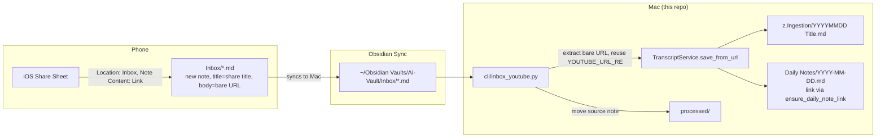

# fix: Restore iPhone YouTube share ingestion after Obsidian mobile 1.13

**Created:** 2026-07-31

---

## Summary

Obsidian Mobile 1.13 (released 2026-07-30) replaced the iOS Share Sheet's old behavior with a new **Locations** system (vault + folder + template). The old implicit "append shared URL into today's daily note" behavior — which `cli/scrape_notes.py`'s iPhone share flow depends on — is gone unless a Location is explicitly wired to reproduce it, and the user's default Location no longer does. A real share attempt ("system design course...") is confirmed lost: it exists in neither the current vault (`~/Obsidian Vaults/AI-Vault`) nor the legacy iCloud vault.

This plan restores a working end-to-end path from "share a YouTube video on iPhone" to "transcript note lands in `z.Ingestion/`," by adding a new ingestion source that reads from an Obsidian Location's output folder (a "New Note" Location, the model 1.13 actually supports) instead of depending on the removed daily-note-append behavior. It also fixes one confirmed stale path in the Chrome extension's README.

---

## Problem Frame

`CLAUDE.md` documents the iPhone share flow as: Obsidian's iOS share sheet appends a bare YouTube URL into the vault-root `Daily Notes/YYYY-MM-DD.md` (well, historically the vault-root `YYYY-MM-DD.md`), and `cli/scrape_notes.py` picks it up via `find_date_only_files()` (`cli/scrape_notes.py:128`), which only matches files named exactly `YYYY-MM-DD.md` in the vault root.

Obsidian Mobile 1.13's new Share Sheet redesign (see Sources) replaces that flow with configurable **Locations**, each defining a vault, a destination folder, and a note template — i.e. shared content becomes a **new, arbitrarily-titled note in a folder**, not a line appended to a date-named note. The user is mid-way through configuring a Location named "Inbox" (screenshot: Vault = "Current Vault", Note Content = "Full Text"), but:

- a completed share ("system design course...") is not present in either `~/Obsidian Vaults/AI-Vault` or the legacy `~/Library/Mobile Documents/iCloud~md~obsidian/Documents/AI-Vault` (verified by filesystem search)
- no `Inbox` folder currently exists in either vault
- `cli/scrape_notes.py`'s detection logic has no way to see notes landing in an arbitrary folder under an arbitrary title

Net effect: shared YouTube videos currently vanish from the user's perspective, and nothing in the repo can pick them up even once the phone side is reconfigured, because the pipeline only understands the old root-`YYYY-MM-DD.md` shape.

---

## Requirements

- R1: A note created by the iOS Share Sheet's "Inbox" Location (or equivalent) is reliably ingested into `z.Ingestion/` as a titled transcript note, without requiring the old daily-note-append behavior.
- R2: Ingestion is idempotent and safe to run repeatedly (matches existing `archive_youtube.py` / `daily_note_youtube.py` / `scrape_notes.py` conventions — dedup, retry-on-lock, `--dry-run`).
- R3: A successfully ingested share still produces a link in today's `Daily Notes/YYYY-MM-DD.md`, preserving current visibility (`ensure_daily_note_link`).
- R4: The phone-side Location is documented with a concrete, minimal configuration that produces input the pipeline can parse (this is operational guidance, not code — see Operational Notes).
- R5: `chrome-extension/README.md`'s stale absolute repo path is corrected.

Non-requirement: reproducing Obsidian's removed "append to daily note" share behavior itself — that's an Obsidian app capability decision, not something this repo can restore.

---

## Key Technical Decisions

**KTD1 — Add a fourth ingestion source (`Inbox/` folder scan) rather than trying to restore daily-note-append behavior.**
Obsidian's new Locations model is fundamentally "new note in a folder," not "append to existing note" (confirmed via the 1.13 changelog and forum threads — see Sources). Fighting that by hunting for a Location mode that still appends is not reliable long-term. Building a new scanner that reads whatever Location writes is the same shape as the three existing scripts (`archive_youtube.py` scans `Untitled*.md`, `daily_note_youtube.py` scans `Daily Notes/YYYY-MM-DD.md`, `scrape_notes.py` scans vault-root `YYYY-MM-DD.md`) — one more source glob, same `TranscriptService` sink. (see origin: none — direct investigation this session)

**KTD2 — Recommend "Link" as the phone-side Note Content, not "Full Text."**
The Location's "Note Content: Full Text" setting (visible in the screenshot) would have Obsidian's on-device Safari-style page scrape write full page text into the new note — an inferior, redundant copy of what `TranscriptService` already fetches server-side (title, description, real transcript via captions/Transcript.lol). Setting Note Content to "Link" makes the created note's body just the bare URL, which reuses the exact same `YOUTUBE_URL_RE`-based detection already shared by `daily_note_youtube.py` and `scrape_notes.py` — no new URL-extraction logic needed, and no duplicate/conflicting content to reconcile.

**KTD3 — New script `cli/inbox_youtube.py`, folded into `run_archive.sh`, not a new mode bolted onto `scrape_notes.py`.**
`scrape_notes.py`'s contract is specifically "vault-root `YYYY-MM-DD.md`" (its OCR/image-embed handling assumes that shape). The Inbox folder holds one note per share with a real title, not a per-day rollup — closer to `daily_note_youtube.py`'s per-file URL-extraction shape than `scrape_notes.py`'s per-day shape. A new script keeps each of the four scripts single-purpose per `CLAUDE.md`'s existing "one file per source" pattern in `cli/`.

---

## High-Level Technical Design

---

## Implementation Units

### U1. Add `cli/inbox_youtube.py` — Inbox-folder YouTube ingestion

**Goal:** Scan a vault `Inbox/` folder for notes whose body is (or contains) a bare YouTube URL, route each through the existing transcript pipeline, and clear the source note the same way the other three ingest scripts do.

**Requirements:** R1, R2, R3

**Dependencies:** None (new file; imports existing helpers)

**Files:**
- `cli/inbox_youtube.py` (new)
- `tests/test_inbox_youtube.py` (new)

**Approach:**
- Mirror `cli/daily_note_youtube.py`'s structure: reuse its `YOUTUBE_URL_RE`, `extract_youtube_id` / `fetch_youtube_metadata` from `archive_youtube.py`, and `TranscriptService` from `transcript_server.py`.
- Default `--vault-root` to `DEFAULT_OUTPUT_DIR.parent` (same convention as the other three scripts), scan `<vault-root>/Inbox/*.md`.
- For each note: read content, find bare YouTube URL(s) via `extract_bare_youtube_urls`-equivalent (reuse the function from `cli/scrape_notes.py` rather than duplicating it — consider promoting it to `export_transcripts.py` or importing directly from `scrape_notes` as `daily_note_youtube.py`-style scripts already cross-import).
- On success per URL: call `TranscriptService.save_from_url(..., mode="full", daily_note_path=vault_root / "Daily Notes" / f"{date.today().isoformat()}.md")` — same call shape as `scrape_notes.py:379-385` — so R3 (daily note link) is satisfied for free.
- On success and no remaining non-URL content in the note: move the source note into `processed/` (reuse `unique_processed_path` pattern from `scrape_notes.py`).
- On failure: leave the note in place; do not silently delete a share the pipeline couldn't process. Print a clear reason (mirrors `daily_note_youtube.py`'s `annotate_failed_url`/shorten_reason conventions where practical — a comment-line failure annotation in the note body is optional for v1; a stderr log line is the minimum bar).
- Support `--dry-run` and `--force` flags matching the other three scripts.

**Patterns to follow:** `cli/daily_note_youtube.py` (URL extraction + per-URL processing loop), `cli/scrape_notes.py` (`unique_processed_path`, retry-on-lock file I/O via `read_text_with_retry`/`write_text_with_retry`).

**Test scenarios:**
- Happy path: `Inbox/Some Shared Title.md` containing only a bare YouTube URL → transcript note written to `z.Ingestion/`, link appended to today's `Daily Notes/YYYY-MM-DD.md`, source note moved to `processed/`.
- Note with URL plus extra text (e.g. "Full Text" was left on by mistake) → URL is still detected and processed; verify remaining non-URL text does not block ingestion crashing (define expected behavior explicitly: process the URL, leave the non-URL remainder in place rather than silently discarding it — do not treat this as equivalent to the URL-only case for archiving purposes).
- No bare YouTube URL in an Inbox note (unrelated shared content) → note is left untouched, no error.
- Two Inbox notes referencing the same YouTube video (duplicate share) → second run does not create a duplicate `z.Ingestion/` file (covers R2, reuses existing dedup-by-destination-exists check).
- `--dry-run` → prints intended action, writes nothing, moves nothing.
- Transient file-lock error (`OSError` errno 11) while reading/writing under Obsidian Sync → note is left in place for retry on next run, matching `scrape_notes.py`'s `had_transient_error` handling.
- Failed transcript fetch (private/removed video) → note stays in `Inbox/` (not moved to `processed/`), clear stderr reason logged.

**Verification:** Run `python3 cli/inbox_youtube.py --dry-run` against a scratch vault fixture and confirm printed plan matches expectations; run the real script and confirm `z.Ingestion/`, `Daily Notes/YYYY-MM-DD.md`, and `processed/` all update as described.

---

### U2. Wire `cli/inbox_youtube.py` into the archive orchestrator

**Goal:** Make the new source run automatically alongside the other three, consistent with how the pipeline is already scheduled.

**Requirements:** R1

**Dependencies:** U1

**Files:**
- `cli/run_archive.sh`
- `CLAUDE.md` (Running scripts section — add the new script alongside the existing three)
- `README.md` (bullet list mirroring the existing "3. Process iPhone-shared daily notes..." section)

**Approach:** Add `/usr/local/bin/python3 inbox_youtube.py` as a fourth line in `cli/run_archive.sh`, after `scrape_notes.py`, following its existing ordering convention (each script only touches its own file shape, so order relative to the other three does not matter functionally — append at the end to minimize diff). Update the two doc files to list the fourth stage.

**Patterns to follow:** Existing `cli/run_archive.sh` structure; existing "iPhone share flow" documentation blocks in `CLAUDE.md` and `README.md`.

**Test expectation:** none -- shell orchestration and documentation only, no behavior to unit test beyond U1's own coverage.

**Verification:** `cat cli/run_archive.sh` shows the new line; manually invoke the updated script against a scratch vault and confirm all four sub-scripts run in sequence without error.

---

### U3. Fix stale absolute path in `chrome-extension/README.md`

**Goal:** Correct the server-start command, which still references the pre-rename repo path.

**Requirements:** R5

**Dependencies:** None

**Files:**
- `chrome-extension/README.md`

**Approach:** Replace `/Users/leon/Documents/Code/vault-orchestrator/cli/transcript_server.py` with `/Users/leon/Documents/Code/Obsidian-vault-orchestrator/cli/transcript_server.py` (matches the corrected paths already used elsewhere, e.g. `cli/scrape_notes.py`'s own docstring at line 20-21, which still has the same stale path and should be fixed in the same pass for consistency).

**Patterns to follow:** N/A — single string replacement.

**Test expectation:** none -- documentation-only change.

**Verification:** `grep -rn "Documents/Code/vault-orchestrator" .` returns no matches after the change (excluding `.git` history).

---

## Scope Boundaries

**In scope:** U1-U3 above; confirming (not necessarily fixing) that the phone's Obsidian app is connected to the Obsidian Sync remote vault named `AI Vault` per the existing `Obsidian Sync.md` runbook.

**Out of scope / not attempted by this plan:**
- Any code change to make Obsidian's iOS app itself append to the daily note again — that behavior was removed by Obsidian 1.13 and is outside this repo's control.
- Replacing `TranscriptService`'s own title/description/transcript fetch with content scraped by Obsidian's on-device "Full Text" share (KTD2 explicitly avoids this).
- Migrating the daily-note-based ingestion flow (`daily_note_youtube.py`, `scrape_notes.py`) away from their current root-`YYYY-MM-DD.md` / `Daily Notes/YYYY-MM-DD.md` shapes. Those still work for any flow that does append to those files (e.g. manual edits, other automations); this plan adds a new source alongside them rather than replacing them.

### Deferred to Follow-Up Work

- Broader redesign of YouTube ingestion around Obsidian Locations as the primary phone-side entry point (the user noted this is a possibility only "if we change the youtube ingestion from daily note" — not yet decided). U1-U3 intentionally keep the existing three scripts untouched so this stays reversible.
- Failure annotation directly in `Inbox/` notes (mirroring `daily_note_youtube.py`'s `fail:` line convention) — v1 uses a stderr log line only; upgrade later if failed Inbox shares become a frequent enough case to need in-vault visibility.

---

## Operational Notes (phone-side, non-code)

These steps are not part of the code change but are required for U1-U3 to have any effect:

1. Confirm the iPhone's Obsidian app is connected to the Obsidian Sync remote vault named `AI Vault` (same identity documented in `Obsidian Sync.md` for the Android tablet) — not a leftover local/iCloud-only vault. Obsidian Sync uses vault identity, not filesystem path, so the phone's local storage location doesn't need to match the Mac's.
2. In the Share Sheet's Location editor (the screen in the screenshot), explicitly pick the named vault rather than leaving "Current Vault" selected, to avoid ambiguity if more than one vault is ever open on the phone.
3. Set the Location's destination folder to `Inbox` (create it if the Location editor requires an existing folder).
4. Set **Note Content** to **Link** (not **Full Text**) — see KTD2.
5. Share a YouTube video from the YouTube app once U1 is deployed and confirm a note appears under `Inbox/` on the Mac (post-sync), then confirm it disappears from `Inbox/` and a corresponding file appears in `z.Ingestion/` and a link appears in today's `Daily Notes/YYYY-MM-DD.md` after the next `run_archive.sh` tick.

---

## Sources & Research

- [Obsidian 1.13 Mobile (Public) changelog](https://obsidian.md/changelog/2026-07-30-mobile-v1.13.4/) — confirms the new iOS Share Sheet with configurable Locations (vault, folder, template) shipped 2026-07-30, one day before this investigation; this is the root cause of the broken share flow.
- Obsidian Forum search results indicating Locations support "new note," "today" (daily note), and "select a note" destination modes — used to inform KTD1/KTD2's framing, though the exact per-Location UI for choosing between these modes could not be confirmed without live access to the phone.
- Direct filesystem verification this session: searched both `~/Obsidian Vaults/AI-Vault` and the legacy `~/Library/Mobile Documents/iCloud~md~obsidian/Documents/AI-Vault` for the user's lost "system design course" share — confirmed absent from both, and no `Inbox` folder exists yet in either.
